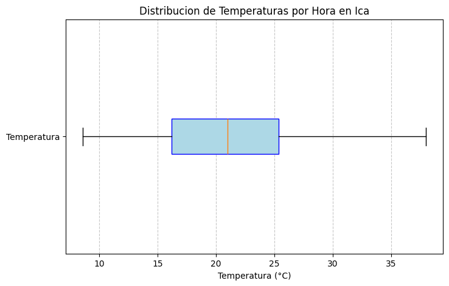

# ETL Pipeline - Clima Histórico de Ica

Quise practicar mis conocimientos de Python y ETL creando un pipeline sencillo con datos reales.
El proyecto consiste en extraer datos históricos del clima de Ica desde la API de Open-Meteo,
transformarlos y guardarlos en un CSV listo para análisis.

## Tecnologías utilizadas

- Python 3.x
- urllib (solicitudes HTTP)
- matplotlib (visualización)
- numpy (cálculos estadísticos)
- csv (almacenamiento)

## Estructura del pipeline

### Extract

Consulté la API de Open-Meteo para obtener registros horarios de temperatura y precipitación
de Ica desde 2020 hasta 2025.

- Fuente: [Open-Meteo Historical Weather API](https://archive-api.open-meteo.com)
- Coordenadas: Ica, Perú (-14.0678, -75.7286)
- Variables: `temperature_2m`, `precipitation`
- Granularidad: horaria

### Transform

Limpié registros nulos que aparecían por fallos de la API. Luego generé un diagrama de caja
y bigotes para revisar la distribución de las temperaturas, y fue precisamente ese diagrama
el que me confirmó que no había outliers estadísticos: ningún punto apareció fuera de los
bigotes. Por eso decidí no eliminar ningún valor; los extremos registrados son climáticamente
plausibles para Ica, una de las ciudades más cálidas del Perú.



### Load

Guardé el dataset limpio en un archivo CSV con aproximadamente 52,000 registros horarios.

| Campo | Descripción |
|---|---|
| `fecha_hora` | Fecha y hora del registro |
| `temperatura` | Temperatura en °C |
| `precipitacion_mm` | Precipitación en mm |

## Cómo ejecutarlo

1. Clona el repositorio
```bash
git clone https://github.com/tu_usuario/tu_repositorio.git
```

2. Instala las dependencias
```bash
pip install matplotlib numpy
```

3. Abre el notebook
```bash
jupyter notebook main.ipynb
```

4. Ejecuta todas las celdas en orden

El archivo `temperaturas_ica.csv` se generará en la misma carpeta.

## Conclusión

Es un proyecto simple, pero me ayudó a entender cómo funciona un pipeline de datos
de principio a fin y a tomar decisiones con criterio, no solo ejecutar técnicas a ciegas.
